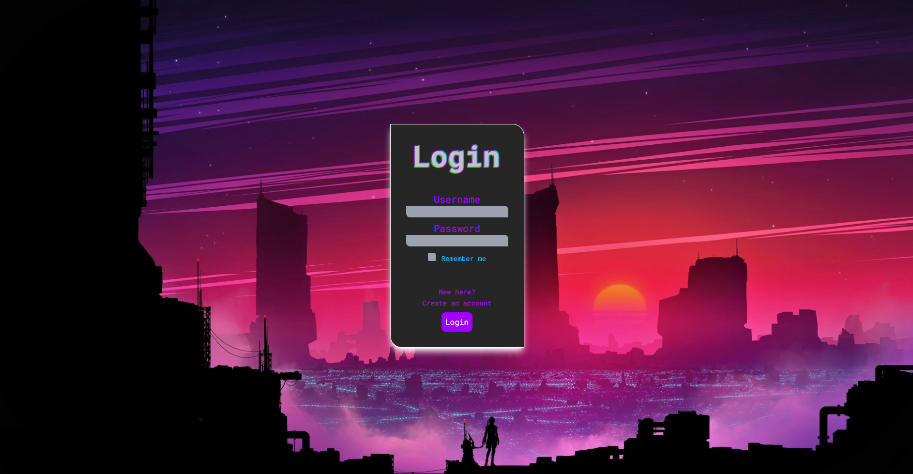
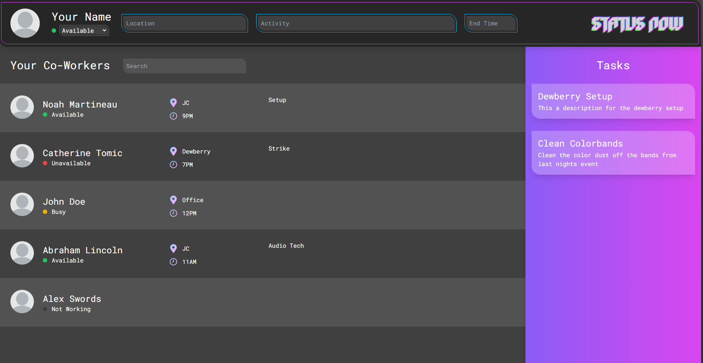

This repository is a fork of the full [PatriotHacks 2024 Project](https://github.com/sp-ec/patriothacks-2024).
This fork contains the entire complete team submission, but I intend to highlight my contributions to the project. We finished a prototype for a web app called **Status Now**, that allows employees to update their shift status, location, and availability in real-time.

## My Contributions
- Designed and implemented the Login Page
- Co-developed the home page
- Created an animated moving logo

## Technologies Used
- React
- Tailwind CSS
- JavaScript

## Screenshots

>Login Screen

>Home Page

